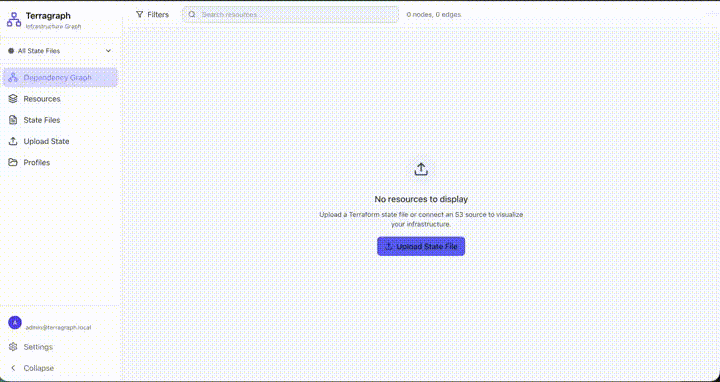
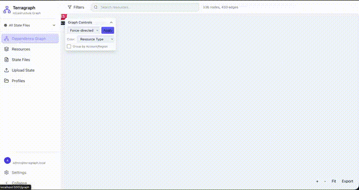

# Terragraph Lite

A lightweight, self-hosted web tool for visualizing Terraform infrastructure dependencies across GitHub repositories and CSP accounts. Upload your Terraform state files and instantly see interactive dependency graphs showing how resources relate across accounts, regions, and repositories.

Terragraph Lite is the single-container edition of [Terragraph](https://terragraph.net) **coming soon**, zero external dependencies and ready to run in seconds.

### State file uploads



### Visualize dependencies



### Create profiles

**Demo coming soon**

## Features

- **Interactive Dependency Graphs** — Cytoscape.js-powered DAG visualization with pan, zoom, search, and filtering
- **Cross-State Visibility** — Upload multiple state files and see how infrastructure in one account/repo depends on resources in another
- **Profiles** — Group state files into logical environments (e.g., "Production," "Staging," "Networking + Shared Services") for focused views
- **Impact Analysis** — Select any resource to trace its upstream and downstream dependencies
- **Resource Filtering** — Filter by resource type, AWS account, region, or Terraform provider
- **User Management** — Local auth with support for multiple users and profile sharing
- **State File Parsing** — Supports `terraform show -json` plan output and raw `.tfstate` files
- **Collapsible Hierarchy** — Resources grouped by AWS account → region → service, expandable and collapsible

## Quick Start

```bash
docker run -d \
  -p 3001:3001 \
  -v terragraph-data:/data \
  ghcr.io/your-org/terragraph-lite:latest
```

Open [http://localhost:3001](http://localhost:3001) and upload your first state file.

### Docker Compose

```yaml
services:
  terragraph:
    image: ghcr.io/your-org/terragraph-lite:latest
    ports:
      - "3001:3001"
    volumes:
      - terragraph-data:/data
    environment:
      - AUTH_DISABLED=true  # Remove to enable user auth

volumes:
  terragraph-data:
```

```bash
docker compose up -d
```

## Configuration

| Variable | Default | Description |
|----------|---------|-------------|
| `AUTH_DISABLED` | `false` | Set to `true` to skip login (single-user/homelab mode) |
| `DATABASE_URL` | `file:/data/terragraph.db` | SQLite database path |
| `DATA_DIR` | `/data` | Persistent data directory |
| `LOG_LEVEL` | `warn` | Logging verbosity: `silent`, `error`, `warn`, `info`, `debug` |
| `PORT` | `3001` | HTTP port |

## Need More?

Terragraph Lite is designed for individual exploration and small-team use. If you need GitHub webhook ingestion, automated state syncing, team collaboration, or enterprise-scale infrastructure mapping — **Terragraph Cloud is coming soon.** Star this repo to stay updated.

## License

Required Notice: Copyright 2026 Dickie

[PolyForm Noncommercial 1.0.0](LICENSE) — Free for personal use, research, homelabs, education, and nonprofit organizations. Commercial use requires a separate license.
